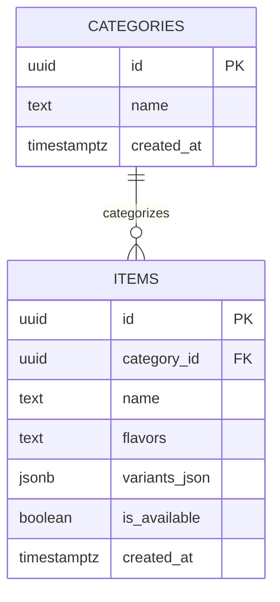

# Brew ni Cat Connect — Database Design

**Version:** 0.1 Draft
**Last updated:** 2026-08-24
**Status:** Phase 2 read-only discovery; no schema implementation or migration

## 1. Scope

This document records only the production catalog structures observed through existing POS source inspection and controlled read-only Supabase discovery for the Phase 2 public menu. It does not authorize schema changes, administrative access, customer data, ordering, inventory, sales, expenses, or POS synchronization.

No table, policy, function, trigger, migration, or production row was created, changed, or deleted during discovery.

## 2. Discovered Catalog Tables

### 2.1 `categories`

| Field | Observed role | Application use |
| --- | --- | --- |
| `id` | Category identifier | Joins items to a category; retained inside the typed catalog model and not displayed |
| `name` | Public category name | Category heading and category navigation label |
| `created_at` | Record creation timestamp | Not retrieved or displayed in Phase 2 |

### 2.2 `items`

| Field | Observed role | Application use |
| --- | --- | --- |
| `id` | Item identifier | Stable React/model identity; not displayed |
| `category_id` | Reference to `categories.id` | Groups each item under its category |
| `name` | Public item name | Menu item heading |
| `flavors` | Pipe-delimited flavor names | Split, trimmed, deduplicated, and mapped to a typed string list |
| `variants_json` | Variant definitions | Parsed defensively into variants, current prices, flavor-price overrides, and optional descriptions |
| `is_available` | Current availability flag | Mapped to `available`, `unavailable`, or `unknown` |
| `created_at` | Record creation timestamp | Not retrieved or displayed in Phase 2 |

## 3. Variant Shape

Observed entries inside `items.variants_json` use these application-relevant properties:

| Property | Meaning | Mapping rule |
| --- | --- | --- |
| `id` | Variant identifier | Kept as a non-displayed UI key; a deterministic local key is used only when absent |
| `name` | Size or variant label | Trimmed; invalid unnamed entries are omitted |
| `basePrice` | Current base price | Accepted only when finite and non-negative |
| `priceByFlavor` | Flavor-to-price object | Valid flavor names and finite non-negative prices become typed pairs |
| `description` | Optional variant/combo description | Trimmed and omitted when empty |

The database returns `variants_json` as structured JSON in normal Data API use; the mapper also accepts a JSON string so it can safely consume the representation found in the POS code and deterministic tests. Malformed values do not produce fabricated options or prices.

## 4. Relationships and Catalog Interpretation



The exact physical SQL types above are based on the existing POS TypeScript/schema use and should be confirmed from an approved migration/schema export before any future schema work. Phase 2 performs no migration.

- Six categories and sixteen items were observed during privileged local read-only discovery; none of the sixteen was unavailable at the observation time.
- There is no discovered public menu view, catalog RPC, or explicit display-order field.
- Phase 2 therefore sorts valid category and item names alphabetically and documents that behavior rather than inventing a business order.
- Combos/packages are represented by ordinary items and variant descriptions rather than a separate public combo relation.
- Add-ons are hardcoded in the existing POS application, not stored in a discovered live Supabase catalog table. The public site does not present those constants as live database facts.

Counts are discovery evidence, not a permanent business promise. The current runtime response remains authoritative.

## 5. Public Access and RLS Observation

Read-only Data API probes using both locally available public credentials returned HTTP 200 and zero rows for `categories` and `items`. A controlled privileged read-only comparison confirmed that the production tables contain catalog rows. This behavior is consistent with the existing Row Level Security or API policy filtering anonymous access; the exact policy definition was not changed or inferred beyond the observed response.

Consequences:

1. the browser runtime uses only `NEXT_PUBLIC_SUPABASE_URL` and `NEXT_PUBLIC_SUPABASE_PUBLISHABLE_KEY`;
2. the application shows a truthful empty or recoverable error state when no public catalog can be returned;
3. it does not use privileged access as a fallback;
4. a live public catalog requires an owner-approved, least-privilege `SELECT` policy or dedicated public view designed and reviewed outside this no-mutation phase; and
5. a future policy must expose only approved catalog fields and must be tested from the anonymous role before deployment.

## 6. Application Boundary

```text
Menu page
  -> typed catalog component
  -> fetchPublicMenu()
  -> public Supabase client
  -> SELECT categories + SELECT items
  -> defensive row-to-domain mapping
  -> customer-facing category/item/variant view
```

Queries are centralized under `src/lib/menu` and `src/lib/supabase`. JSX does not perform ad hoc table reads. CI and production builds do not need a live connection because retrieval begins at browser runtime; missing configuration produces a controlled public error state.

## 7. Deferred Design Work

Before Phase 3 or Phase 4 database work:

- approve and test the minimum public catalog read boundary;
- obtain a canonical schema/migration export and confirm physical types, constraints, indexes, and foreign-key behavior;
- decide whether categories need an explicit display-order and publication field;
- model add-ons only if approved requirements need live add-on data;
- separate public catalog availability from internal inventory data where necessary; and
- design order, customer, authentication, and RLS structures in an isolated environment before any production migration.
