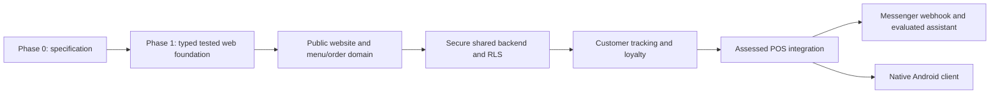

# Brew ni Cat Connect — Emerging Technologies

**Version:** 0.1 Draft\
**Date:** 2026-08-18\
**Document status:** Planning baseline\
**Implementation status:** All technologies in this document are planned or under evaluation; none is represented here as integrated, deployed, or tested.

## 1. Purpose

Brew ni Cat Connect will use modern technology only where it solves a documented customer or operational need. The aim is one maintainable omnichannel platform—not separate databases and duplicated rules for the website, Android application, Messenger assistant, and existing POS integration.

The Version 0.1 direction is:

- **Web:** Next.js App Router, React, and TypeScript.
- **Cloud backend:** Supabase capabilities, introduced incrementally after schema and security design.
- **Realtime:** Supabase Realtime for authorized order-status refresh signals, with polling/manual refresh as the required degraded-mode fallback.
- **Conversational channel:** Meta Messenger Platform through a secured server-side webhook in a later phase.
- **Mobile:** native Android with Kotlin and Jetpack Compose in a later phase.

Exact package and platform versions must be pinned and recorded in `software-and-apis.md` when installed. Business behavior remains subject to confirmed requirements.

## 2. Selection principles

Each technology must demonstrate:

1. **Purpose** — a defined user or business problem.
2. **Fit** — an advantage over a simpler solution for this project.
3. **Shared architecture** — reuse of backend data and business rules.
4. **Security and privacy** — data minimization, least privilege, secure secrets, and appropriate auditability.
5. **Failure behavior** — a usable degraded mode or explicit unavailable state.
6. **Maintainability** — an active ecosystem, suitable license, testability, and a realistic student/team learning cost.
7. **Evidence** — measurable acceptance criteria rather than an “emerging” label alone.

## 3. Technology assessment summary

| Technology | Status | Genuine purpose | Primary limitation | Introduction gate |
|---|---|---|---|---|
| Next.js App Router + React + TypeScript | Selected for Phase 1 foundation | Responsive, discoverable business site and customer ordering UI with shared typed web code | Framework/runtime complexity and dependency updates | Initial specification accepted; lint, types, tests, and build configured |
| Supabase cloud platform | Planned for Phase 4 | Managed PostgreSQL, authentication, controlled data access, and optional realtime/storage/server functions | Vendor/platform coupling; correct RLS and key separation require care | Approved data model, threat review, environment strategy, RLS tests |
| Realtime order updates | Planned after ordering/backend | Timely customer-visible order status across supported channels | Connectivity, ordering, and delivery are not guaranteed; adds subscription cost/complexity | Canonical order-state model and authorization implemented first |
| Secured Messenger webhook | Deferred to Phase 7 | Meet customers on an existing channel for menu questions, discovery, guided ordering, and tracking | Platform policies, review, message windows, identity linking, webhook security | Stable shared backend and Meta configuration/approval |
| Conversational/AI assistance | Candidate within Phase 7; not automatically required | Interpret natural-language discovery questions and improve relevant recommendations | Incorrect or ungrounded output, privacy, cost, latency, explainability | Defined use cases outperform deterministic flow; evaluation and fallback approved |
| Native Android with Kotlin/Compose | Deferred to Phase 8 | Native customer experience using the same accounts, ordering, tracking, and loyalty services | A second client increases release/testing burden | Stable versioned backend contract and Android architecture decision |
| POS integration adapter/events | Deferred to Phase 6 | Exchange menu/availability/order/status information without exposing POS internals | Unknown legacy constraints, conflicts, offline behavior, migration risk | Existing POS assessment and source-of-truth contract completed |

## 4. Modern web application

### 4.1 Purpose and system role

Next.js App Router, React, and TypeScript are recommended for the official business website and web ordering client. The stack supports responsive component composition, server-rendered public content where appropriate, route-level loading/error boundaries, and typed shared interfaces.

The web application is both:

- a public presentation channel for confirmed Brew ni Cat content; and
- an authenticated/unauthenticated client of the shared application boundary for later menu and ordering capabilities.

It does not replace the existing POS and must not connect to POS tables or credentials.

### 4.2 Justification

- One stack can support public content and transactional customer workflows.
- TypeScript reduces interface mismatches and supports maintainable automated checks.
- Server-side capabilities can protect integrations and secrets that must never enter a browser bundle.
- The ecosystem supports unit, component, accessibility, and end-to-end testing.

### 4.3 Limitations and controls

- Carefully separate server-only modules from client code.
- Keep dependencies limited and pinned; review licenses and maintenance before addition.
- Avoid shipping unnecessary JavaScript; measure mobile performance.
- Treat framework caching as an explicit design decision for availability-sensitive menu data.
- Use accessible semantic HTML before custom interaction patterns.

## 5. Cloud computing with Supabase

### 5.1 Purpose and system role

Supabase is planned as the shared cloud data platform because it can provide:

- managed PostgreSQL for customer-facing domain data;
- authentication and session integration;
- Row Level Security (RLS) close to stored data;
- realtime database-change subscriptions where justified;
- object storage if approved content/user assets require it; and
- server-side functions for narrow, validated tasks where the application runtime is not the right boundary.

Capabilities will be adopted only as requirements justify them. Storage and functions are not automatically in scope.

### 5.2 Why it fits

A relational database suits products/options, immutable order snapshots, state history, loyalty ledgers, and integrity constraints. A managed service reduces infrastructure administration for a small business while offering a backend usable by web, Android, Messenger services, and a controlled POS adapter.

### 5.3 Security and privacy

- Public/anonymous client keys are not authorization; RLS and server-side checks enforce access.
- Service-role credentials remain only in protected server environments and are never exposed to a web or Android client.
- Every customer-owned table requires deny-by-default RLS policies and policy tests before production access.
- Collect only fields justified by a requirement and retention policy, with consideration for the Philippine Data Privacy Act of 2012 (RA 10173).
- Separate development, test, and production projects/data.
- Protect database migrations, backups, and administrative access with least privilege and multi-factor authentication where supported.
- Never place credentials, tokens, personal data, or production records in Git or test fixtures.

### 5.4 Limitations and mitigations

| Limitation | Planned mitigation |
|---|---|
| Platform dependency | Keep domain rules in tested application modules and use standard PostgreSQL/migrations where practical |
| RLS complexity | Model access explicitly, use deny-by-default policies, automated role/policy tests, and peer review |
| Network dependency | Clear unavailable states, retry-safe/idempotent writes, monitoring, and documented recovery procedures |
| Cost/usage limits | Establish usage budgets/alerts and avoid unnecessary subscriptions or large assets |
| Schema changes affect multiple clients | Version contracts, use backward-compatible migrations, and stage releases |

## 6. Realtime order status

### 6.1 Purpose

Realtime technology can reduce repeated manual refreshes and keep customers informed when an order moves through approved states such as accepted, preparing, ready, or completed. It may later keep menu availability synchronized where the business process can support accurate updates.

### 6.2 Correct role

Realtime is an advisory delivery channel, not the source of truth. The database and validated application service hold canonical state. A client receiving an event re-fetches the authorized current record, which also protects against missing, duplicate, delayed, or out-of-order events.

### 6.3 Limitations and degraded mode

- Connections can drop on mobile networks or when browsers suspend background tabs.
- Delivery order and exactly-once processing are not assumed.
- Subscriptions consume resources and must be scoped to the authenticated customer/order.
- When unavailable, clients display the last-confirmed time, reconnect with bounded backoff, and may use conservative polling.
- Order creation and state transitions continue to require transactional server-side validation.

### 6.4 Acceptance measures

Before release, tests should demonstrate that an authorized customer receives a current-state refresh, an unrelated customer receives no order event/data, an out-of-order event does not regress state, and reconnecting yields the canonical latest state. Performance targets belong in the non-functional requirements and must be measured rather than presumed.

## 7. Conversational and AI integration

### 7.1 Purpose

The Messenger assistant is planned to support customer-initiated:

- confirmed menu and FAQ inquiries;
- product discovery based on current catalog attributes;
- guided assembly of an order draft;
- secure order tracking after an approved identity-linking step; and
- product recommendations when a documented approach provides genuine value.

The same shared backend supplies catalog, availability, and order information. No parallel chatbot menu/order database is permitted.

### 7.2 Deterministic before generative

Structured menus, buttons, validated forms, retrieval, and rule-based routing should handle deterministic tasks. A conversational model is introduced only when evaluation shows it improves natural-language understanding or discovery beyond those tools.

If used, an AI component may interpret a request or rank eligible catalog items; it must not invent products, prices, ingredients, availability, promotions, policies, preparation times, business facts, or order status. Server-side business rules—not model output—validate and commit any transaction.

### 7.3 Secured Messenger webhook

The future server-side webhook must:

1. validate the provider's signature and request freshness before processing;
2. handle webhook verification using protected configuration;
3. deduplicate/replay-protect events;
4. acknowledge within the platform's timing requirements and queue slower work when appropriate;
5. keep page tokens/webhook secrets out of clients and logs;
6. rate-limit abusive traffic and bound conversation context;
7. minimize stored message content and document retention; and
8. comply with then-current Meta policies before deployment.

Exact Meta platform rules must be verified from current official documentation during Phase 7.

### 7.4 AI risk controls and evaluation

| Risk | Control | Evidence before release |
|---|---|---|
| Invented business facts | Ground responses in approved structured records; return a known-data gap when evidence is absent | Test set includes unknown and unavailable products/business facts |
| Unsafe order action from ambiguity | Require explicit structured confirmation and full server validation | Ambiguous-dialog and duplicate-submit tests |
| Personal-data leakage | Minimize context, redact logs, authorize order lookup, define retention | Privacy review and cross-account authorization tests |
| Prompt manipulation or tool misuse | Treat message text as untrusted data; allowlist tools/actions; validate all arguments | Adversarial test cases and audit logs without secrets |
| Poor recommendations | Restrict candidates to available catalog and disclose recommendation basis where practical | Offline relevance/grounding evaluation with approved sample data |
| Service outage/latency | Fall back to deterministic menu/navigation and clear handoff/status messaging | Dependency failure tests |

Model/provider selection, data-processing terms, cost ceiling, response latency, evaluation threshold, and human-handoff procedure require a later architecture decision. AI is not a Phase 0 or Phase 1 dependency.

## 8. Native Android application

### 8.1 Purpose and system role

A later native Android app using Kotlin and Jetpack Compose may provide mobile-optimized access to authentication, menu, ordering, tracking, loyalty, and customer profile capabilities. It will consume the same versioned application contracts as the website rather than duplicate backend rules.

### 8.2 Justification

- Kotlin is the primary modern language for native Android development.
- Compose supports declarative, reusable UI and testable state management.
- Native integration can support secure local credential storage, notifications, accessibility APIs, and lifecycle-aware connectivity.

### 8.3 Limitations and controls

- A separate client increases testing, accessibility, device compatibility, and release maintenance.
- Offline data may become stale; cached catalog/status must show refresh state, and checkout must revalidate online.
- Tokens use platform-appropriate protected storage and are excluded from logs/backups as applicable.
- Push notifications, if approved, reveal minimal lock-screen content and deep-link only after authorization.
- Android SDK level, architecture, navigation, networking library, persistence, and Play distribution remain deferred decisions.

## 9. Omnichannel integration and the existing POS

### 9.1 Purpose

The intended integration prevents staff from maintaining independent menu/order data for each channel and allows online orders and fulfilment status to pass through controlled business workflows.

### 9.2 Boundary

Public clients and Messenger never access POS internals. A versioned, authenticated adapter/service boundary validates and maps messages between the shared backend and existing POS. The POS assessment must identify authoritative systems before any synchronization code is written.

### 9.3 Required safeguards

- stable identifiers and explicit schema versions;
- idempotent commands/events and transactional outbox/inbox patterns where suitable;
- retry with backoff plus quarantine/dead-letter review;
- validation without guessing mappings or prices;
- event/status history for reconciliation;
- least-privilege service identities and rotated credentials; and
- documented offline/conflict behavior.

The integration mechanism is not selected in Version 0.1 because the existing POS architecture has not yet been assessed.

## 10. Rollout sequence and evidence gates

Each transition requires updated requirements, threat/privacy review where relevant, automated tests, build/lint/type-check evidence, documentation, and an architecture decision when the choice is consequential. Later channels must consume proven shared services rather than race ahead of the backend.

## 11. Data minimization by channel

| Channel | Intended minimum data use | Data that must remain server-side |
|---|---|---|
| Public website | Published business/catalog content and anonymous operational telemetry if approved | Administrative credentials, drafts, private customer/order data |
| Authenticated web/Android | Customer's authorized profile, cart, orders, loyalty, and session metadata | Service credentials, other customers' data, internal integration details |
| Messenger | Platform sender reference and conversation data required for supported request, under a defined retention policy | Platform secrets, service-role keys, unrestricted order/customer records |
| POS adapter | Minimum mapped product/order/status fields required by the integration contract | Customer data not required by the POS workflow, public-client credentials |

Specific retention periods and analytics choices are `TODO: Confirm with Brew ni Cat owner.`

## 12. Deferred and rejected-for-now ideas

- Unnecessary IoT devices, QR scanners, receipt printers, blockchain, or unrelated analytics are not part of the current emerging-technology plan.
- A separate database per channel is rejected because it creates inconsistent products, prices, orders, and loyalty balances.
- Generative AI as an order authority is rejected; it may only assist within validated application boundaries.
- Delivery technology is deferred until the owner confirms delivery scope and policy.
- Storage, notifications, analytics, and serverless functions are introduced only if a requirement justifies them.

## 13. Review checklist

Before marking any technology **Implemented** or **Tested**, record its installed version/license, configuration boundary, threat/privacy considerations, test commands and literal results, failure/degraded mode, deployment procedure, monitoring ownership, and rollback/removal approach. Unverified capabilities remain **Planned**.
