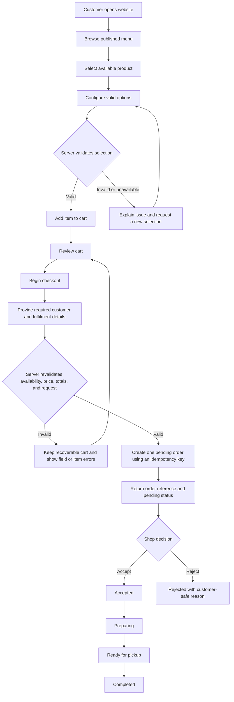
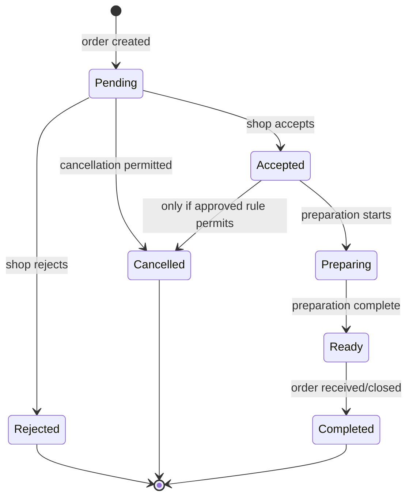
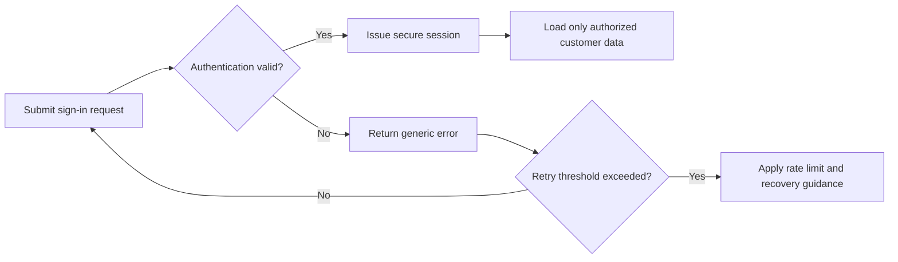
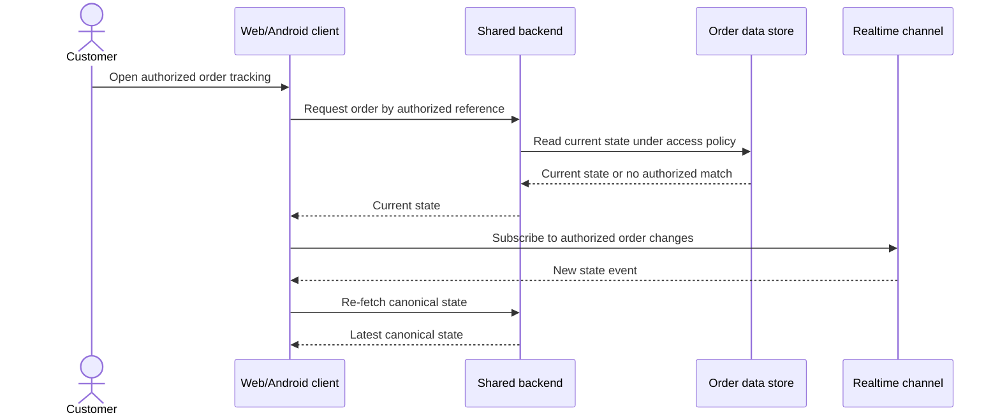
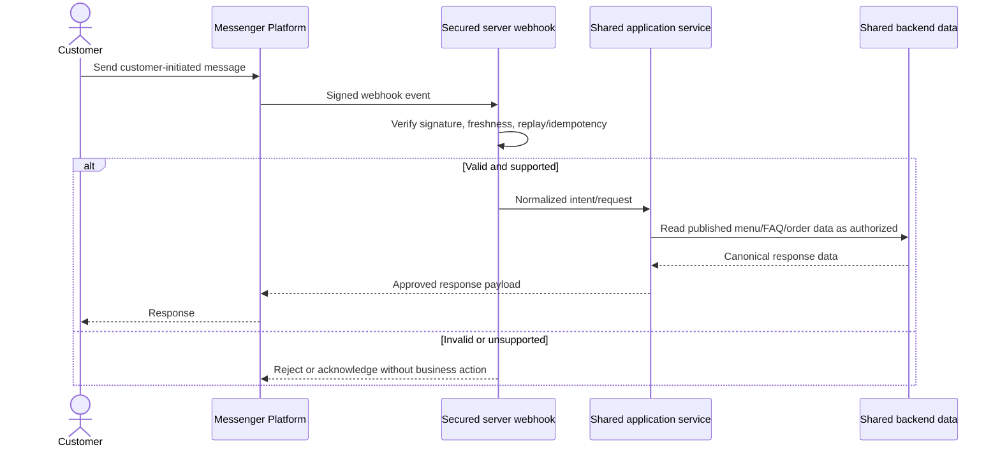
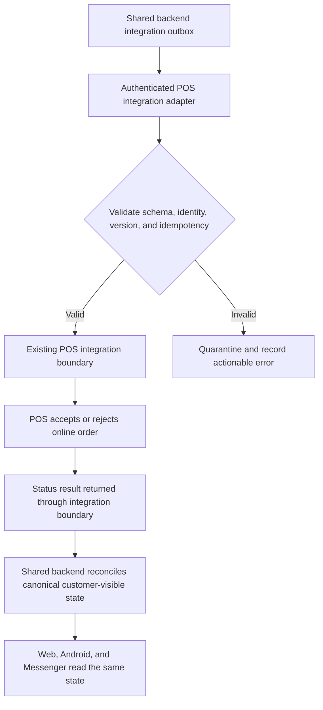
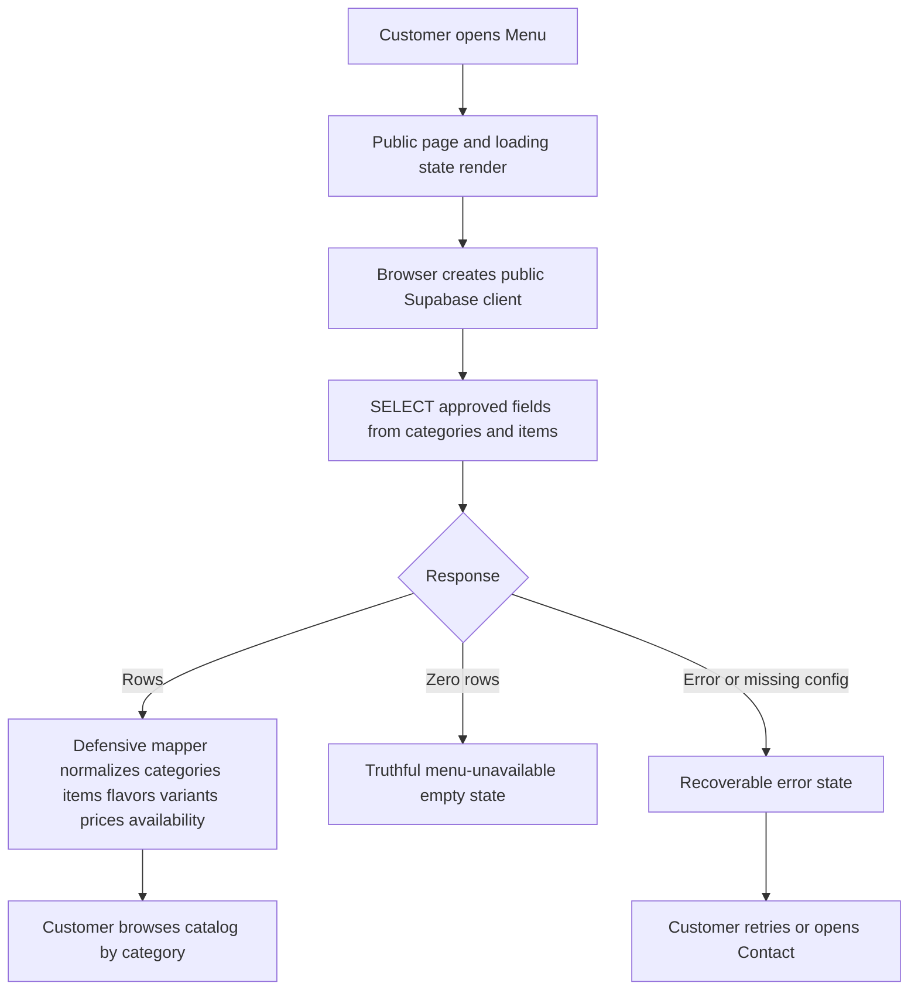

# Brew ni Cat Connect — Expected Execution Paths

**Version:** 0.1 Draft\
**Date:** 2026-08-18\
**Document status:** Planning baseline\
**Implementation status:** Phase 1 is Tested and merged. Phase 2 public discovery routes and the read-only menu retrieval path passed developer automation and are in Testing / Review; the public live-catalog policy and independent review remain open. Ordering and later paths remain Planned or Deferred.

## 1. Purpose and notation

This document defines expected end-to-end behavior for Brew ni Cat Connect. It is a behavioral specification, not evidence that the system exists. Version 0.1 maps each path to requirement ranges below; API contracts, test-case IDs, and verified results will be added as implementation proceeds.

Status terms used throughout the documentation:

- **Planned** — accepted for design but not implemented.
- **In development** — implementation has started but has not met its acceptance criteria.
- **Implemented** — code exists, while some defined verification may still be pending.
- **Tested** — the documented test suite was executed and evidence was recorded.
- **Deferred** — intentionally postponed pending a prerequisite or decision.

Unless explicitly stated otherwise, every path below is **Planned**.

## 2. Cross-cutting execution rules

1. The shared backend is the intended system boundary for customer, catalog, cart, order, loyalty, and tracking operations. Clients must not connect directly to the existing POS.
2. Browser, Android, Messenger, and POS input is untrusted and must be authenticated when required, authorized, validated server-side, and recorded only when necessary.
3. The server calculates authoritative prices, totals, reward eligibility, and valid order-state transitions. A value supplied by a client is never authoritative merely because it was displayed earlier.
4. An operation with a business effect must be idempotent or protected by an idempotency key so retries do not duplicate orders, points, or messages.
5. Errors shown to customers must be useful without exposing secrets, database details, internal identifiers, or stack traces.
6. Business facts that are not yet confirmed remain `TODO: Confirm with Brew ni Cat owner.`

## 3. Public website discovery

### 3.1 Success path

1. A customer opens the website.
2. The application returns the public shell and published business content.
3. The customer navigates through available pages such as home, about, menu preview, gallery, and contact/location information.
4. The layout adapts to the device viewport and remains keyboard-operable.
5. Only confirmed business data or clearly labeled `MOCK DATA — FOR DEVELOPMENT ONLY` is displayed.

### 3.2 Failure and empty-data paths

- If a content request fails, the page retains its usable shell, announces an error accessibly, and offers a retry.
- If a business field is unconfirmed, production presentation must not substitute invented content. During development the field remains `TODO: Confirm with Brew ni Cat owner.`
- If an image fails, meaningful alternative text or a neutral presentation fallback is used without blocking navigation.
- If JavaScript is delayed, essential public content should remain renderable where the chosen page architecture permits it.

## 4. Website ordering

### 4.1 Primary path

Expected success outcome: exactly one order is stored, its line-item snapshot and calculated totals are internally consistent, and the customer receives an order reference plus the latest confirmed status.

### 4.2 Checkout validation and failure paths

| Condition | Expected behavior | Data effect |
|---|---|---|
| Product or option becomes unavailable | Identify affected item, preserve unaffected cart content, and require reconfirmation | No order created |
| Published price changed | Display the authoritative current total and require customer confirmation before submission | No order created before confirmation |
| Missing/invalid field | Associate an accessible error with the field and retain valid input | No order created |
| Duplicate submit or network retry | Reuse the idempotency key and return the original outcome | At most one order created |
| Server/database timeout before outcome is known | Show a pending/retry-safe state and reconcile by idempotency key | Never advise a blind duplicate submission |
| Shop rejects order | Persist `rejected`, show a customer-safe reason when supplied, and stop preparation transitions | Order retained for audit/history according to retention policy |
| Payment workflow needed | Cash and GCash are confirmed for public information. **TODO: Confirm with Brew ni Cat owner.** Define any future online proof/provider, settlement, refund, and failure rules before implementation | No online payment operation or record is created in Phase 2 |
| Delivery requested | The customer may independently book and pay a preferred external rider after arranging the shop order; Brew ni Cat does not control availability, fee, or ETA. In-app rider booking/integrated delivery remains Deferred | Phase 2 displays information only and collects no delivery data |

### 4.3 Order state rules

The initial conceptual state set is `pending`, `accepted`, `rejected`, `preparing`, `ready`, `completed`, and `cancelled`. Exact names and cancellation rules require domain review before database implementation.

Invalid or stale transitions must be rejected by the server and must not overwrite a newer status. Every accepted transition must record actor, timestamp, prior state, new state, and a correlation identifier appropriate for audit and troubleshooting.

## 5. Customer account paths

### 5.1 Registration

1. Customer chooses to create an account.
2. Client collects only required fields and displays the applicable privacy notice.
3. Server/authentication provider validates the request.
4. If verification is configured, the customer completes the verification step.
5. A minimal customer profile is created or linked idempotently.
6. The customer enters an authenticated session.

Failure behavior:

- Existing identifier: guide the customer toward sign-in or password reset without disclosing unnecessary account information.
- Weak/invalid credential input: explain the validation rule without logging the credential.
- Verification link expired: allow a rate-limited replacement.
- Profile provisioning fails after identity creation: retry/reconcile the profile operation rather than create another identity.

The required profile fields and verification policy are `TODO: Confirm with Brew ni Cat owner.`

### 5.2 Login

Session expiry returns the customer to authentication and preserves only non-sensitive, recoverable workflow context where appropriate. Protected data must not remain available from a stale session.

### 5.3 Password reset

1. Customer requests recovery using the configured account identifier.
2. The interface returns a neutral response regardless of account existence.
3. The authentication service sends a single-use, time-limited recovery mechanism when eligible.
4. Customer submits a valid replacement credential.
5. The system invalidates the recovery token and applies the configured session-revocation policy.

Expired, reused, malformed, or rate-limited requests have no credential effect and return customer-safe guidance.

## 6. Order tracking and realtime updates

- A realtime message is a refresh signal, not the sole source of truth; the client re-fetches canonical state.
- If the realtime connection drops, the client indicates that updates may be delayed, reconnects with backoff, and may use bounded polling.
- If the authenticated customer does not own the order, the backend returns no order data.
- Events received out of order must not regress the displayed state.
- Notification channels and timing remain `TODO: Confirm with Brew ni Cat owner.`

## 7. Loyalty and rewards

### 7.1 Earning path

1. An eligible order reaches the configured qualifying state.
2. The server evaluates the documented loyalty rule against the authoritative order snapshot.
3. One immutable loyalty transaction is recorded with an idempotent reference to that order/event.
4. The derived balance is updated or recalculated transactionally.
5. The customer sees the updated balance and transaction reason.

### 7.2 Redemption path

1. Customer selects an available reward.
2. Server checks identity, reward availability, balance, eligibility, and any usage restrictions.
3. Server reserves or deducts value transactionally and applies the reward to the eligible order.
4. Checkout records the reward snapshot and resulting totals.
5. Failed/cancelled order handling releases or reverses the reward exactly once, according to the approved policy.

### 7.3 Failure safeguards

- Duplicate completion events must not award points twice.
- Concurrent redemptions must not produce a negative balance.
- Reversals must reference the original transaction rather than delete history.
- Loyalty formula, qualifying state, expiry, refund, and reward rules are all `TODO: Confirm with Brew ni Cat owner.` No numeric values are assumed.

## 8. Favorites and reordering

1. An authenticated customer adds/removes a product favorite through an idempotent operation.
2. For reordering, the customer selects a previous order.
3. The server retrieves the authorized historical snapshot, then maps each item to the current catalog.
4. Current availability, options, and price are shown; historical price is never silently reused.
5. Unavailable items/options are identified for removal or replacement.
6. A new cart is created and proceeds through normal checkout validation.

A reordered purchase is always a new order and never mutates the historical order.

## 9. Messenger paths (future phase)

### 9.1 Inquiry and product discovery

- Menu and availability answers come from the shared backend, not a separate Messenger database.
- Order-specific answers require a secure account-linking or verification design before release.
- Intelligent recommendations must stay within confirmed catalog data, explain uncertainty where relevant, and offer deterministic navigation when understanding fails.
- Webhook secrets and platform tokens remain server-side.
- Meta account, policy, retention, escalation, supported FAQs, and handoff rules are deferred until the Messenger phase.

### 9.2 Guided ordering failure boundary

Messenger may help discover products and build a draft selection, but the server remains responsible for validation and order creation. If a conversation loses context or detects ambiguity, it must summarize the current draft and direct the customer to a verified confirmation step. No order is submitted solely from an unverified inferred intent.

## 10. Android paths (future phase)

The planned native Android client uses the same application contracts as the website for identity, published menu, carts/orders, tracking, favorites, and loyalty.

- On connectivity loss, read-only cached content may be labeled with its last refresh time; checkout requires current server validation.
- Pending writes use idempotency keys and must reconcile after reconnection.
- Sensitive tokens use platform-appropriate protected storage and are never placed in logs.
- Push notifications, if later justified, are advisory; opening the app fetches canonical order status.
- Minimum supported Android version and notification scope will be documented before implementation.

## 11. Existing POS integration (future phase)

No direct POS integration is implemented or assumed in Version 0.1. The existing POS must first be analyzed without exposing its internal tables to public clients.

### Required POS design decisions before implementation

- Which system is authoritative for product identity, published content, price, availability, order acceptance, fulfilment status, inventory, and refunds.
- Whether integration is API-based, event-based, or performed through a controlled adapter.
- Stable external identifiers, schema/version negotiation, and compatibility policy.
- Idempotency, retry, dead-letter/quarantine, monitoring, and reconciliation procedures.
- Offline operation and conflict resolution.
- Authentication, least-privilege service identity, network boundary, and audit requirements.

### Failure behavior

- POS unavailable: keep the order in an explicit pending/synchronization state; retry with backoff; do not falsely show acceptance.
- Duplicate delivery: deduplicate by integration event/order key.
- Conflicting updates: retain event history, reject invalid transitions, and route unresolved cases for authorized review.
- Unknown product mapping: quarantine the affected message; never guess a product or price.
- Partial batch: acknowledge only successfully processed items and retry the remainder safely.

## 12. Operational failure matrix

| Failure | Customer-visible response | System response | Evidence/monitoring |
|---|---|---|---|
| Network unavailable | Explain offline/delayed state and preserve safe local context | Retry bounded reads; do not duplicate writes | Correlation ID and client-safe telemetry without personal secrets |
| Authentication expired | Request sign-in again | Reject protected operation; rotate/clear session as applicable | Auth event metadata |
| Authorization denied | Generic not-found/denied response as appropriate | Return no protected resource | Denied request metadata, rate-limited |
| Validation failure | Field/item-specific, accessible guidance | Reject before persistence or roll back transaction | Validation category, not sensitive value |
| Backend dependency unavailable | Retry-safe message; status remains unconfirmed | Circuit breaking/backoff where justified | Availability metric and structured error |
| Realtime unavailable | State that live updates are delayed | Reconnect and fetch canonical state | Connection/retry metrics |
| Unexpected server error | Generic message with support/reference code | Roll back transaction and capture trace securely | Correlation ID, alert based on severity |

## 13. Open decisions

- `TODO: Confirm with Brew ni Cat owner.` Required customer data and account verification policy.
- `TODO: Confirm with Brew ni Cat owner.` Pickup workflow, acceptance/rejection reasons, preparation/status terminology, cancellation, and completion policy.
- Cash/GCash are confirmed for display. **TODO: Confirm with Brew ni Cat owner.** Define any future online payment proof/provider and failure/refund policy.
- Customer-arranged external-rider information is confirmed. **TODO: Confirm with Brew ni Cat owner.** Decide whether any future integrated delivery/location workflow enters scope.
- `TODO: Confirm with Brew ni Cat owner.` Loyalty earning, redemption, expiry, and reversal rules.
- POS source-of-truth and interface decisions await a documented assessment of the existing POS.
- Messenger account linking, human handoff, policy, and data-retention design await the Messenger phase.

## 14. Requirements traceability

| Execution path | Functional requirements | Principal non-functional requirements |
|---|---|---|
| Public website discovery | FR-001–FR-009 | NFR-001, NFR-005, NFR-029–NFR-035 |
| Menu, cart, and website ordering | FR-010–FR-030 | NFR-002–NFR-003, NFR-006, NFR-008, NFR-015–NFR-018, NFR-031 |
| Registration, login, and recovery | FR-031–FR-037 | NFR-013–NFR-019, NFR-023–NFR-027 |
| Customer profile, favorites, and reordering | FR-038–FR-043 | NFR-014–NFR-015, NFR-023–NFR-027, NFR-038 |
| Order tracking and realtime fallback | FR-044–FR-049 | NFR-004, NFR-010, NFR-014, NFR-025 |
| Loyalty earning and redemption | FR-050–FR-057 | NFR-006, NFR-014–NFR-015, NFR-021, NFR-025, NFR-038 |
| Messenger inquiry and guided ordering | FR-058–FR-064 | NFR-018, NFR-022–NFR-028 |
| Android journeys and offline handling | FR-065–FR-070 | NFR-019, NFR-025, NFR-028, NFR-036 |
| POS synchronization and reconciliation | FR-071–FR-081 | NFR-006, NFR-008, NFR-021–NFR-022, NFR-038 |
| All networked client/server/integration paths | Applicable FRs above | NFR-012–NFR-028 |
| Cross-cutting failure behavior | Applicable FRs above | NFR-006–NFR-011, NFR-037–NFR-040 |

## 15. Acceptance of this draft

Version 0.1 was checked for alignment with the functional requirements, non-functional requirements, architecture, security/privacy plan, and testing strategy. This is specification review, not runtime test evidence. Each implemented path will later link to executable or manual test cases and their recorded results; until then its status remains **Planned**.

## 18. Phase 2 Read-only Public Menu Path

The initial public observation followed the zero-row branch and remains valid failure-state evidence. After the owner/developer manually disabled RLS on the relevant catalog tables, the current publishable runtime follows the rows branch and renders 6 categories/16 items. The application does not use a privileged credential as fallback and performs no cart action, order submission, database write, authentication, or rider booking. The current grant-based/RLS-disabled access is a production security blocker, not a least-privilege resolution.
