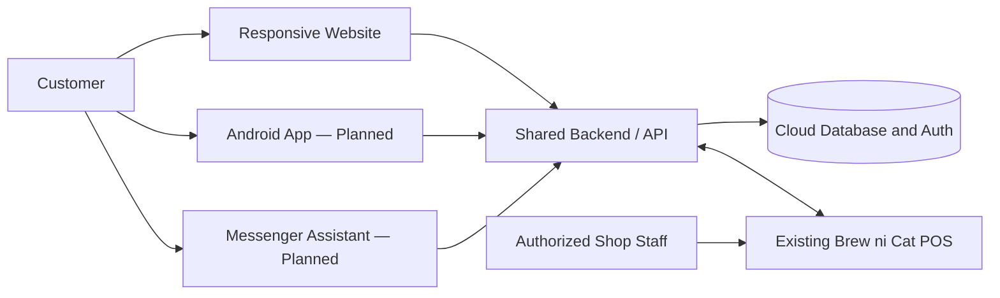

# Brew ni Cat Connect — Software Requirements Specification

- **Version:** 0.1 Draft
- **Date:** 2026-08-18; Phase 2 addendum 2026-08-24
- **Phase:** Living specification through Phase 2
- **Document status:** Version 0.1 remains a draft. Phase 1 is Tested and merged; the implemented Phase 2 showcase passed developer automation and is in Testing / Review. Public live catalog rows remain blocked by the existing anonymous access policy. Later capabilities remain Planned or Deferred as marked.

## 1. Purpose

This Software Requirements Specification (SRS) defines the initial scope, behavior, quality goals, constraints, and acceptance basis for **Brew ni Cat Connect**. It is the documentation gate for later implementation and is intended for the client, project team, academic evaluators, testers, and future maintainers.

Detailed requirements are maintained in:

- [`functional-requirements.md`](functional-requirements.md)
- [`non-functional-requirements.md`](non-functional-requirements.md)
- [`execution-paths.md`](execution-paths.md)
- [`system-architecture.md`](system-architecture.md)
- [`security-and-privacy.md`](security-and-privacy.md)
- [`testing-strategy.md`](testing-strategy.md)

## 2. Product overview

Brew ni Cat Connect is a customer-facing omnichannel platform for Brew ni Cat Coffee Shop. It will combine an official business website with digital menu browsing, online ordering, customer accounts, order tracking, loyalty features, a future Facebook Messenger assistant, and a future Android customer application. These channels are intended to share a centralized backend and consistent business data.

The system addresses the need for customers to discover the shop, inspect accurate menu information, place and track orders, and return through a consistent digital experience. It also creates a controlled integration boundary through which online orders can eventually reach the existing Brew ni Cat POS.

### 2.1 Relationship to the existing POS

The existing Brew ni Cat POS remains the business-side system. Brew ni Cat Connect will **not** recreate sales processing, cashier operations, receipt printing, inventory management, employee management, or other POS capabilities. Before integration work begins, the team must inspect the POS and document source-of-truth rules, identifiers, synchronization, conflict handling, failure recovery, and security boundaries. Direct public access to POS tables is prohibited.

### 2.2 Intended users

| User or stakeholder | Planned interaction |
| --- | --- |
| Guest customer | View official business content, browse the menu, build a cart, and use only those checkout paths approved for guest use. |
| Registered customer | Use account-based ordering, history, tracking, favorites, reordering, and loyalty capabilities as those modules are delivered. |
| Authorized shop staff | Receive or act on online orders through an approved integration or narrowly scoped management interface; maintain approved customer-facing data. |
| Business owner | Approve business rules, content, policies, integrations, and release readiness. |
| Development and QA team | Implement, test, document, deploy, and maintain the system. |
| Academic evaluator / reviewer | Inspect requirements, architecture, code, tests, evidence, and development process. |

## 3. Status model

This project uses the following labels consistently:

| Status | Meaning |
| --- | --- |
| Planned | Approved as part of the working scope but not yet implemented. |
| In development | Implementation has started and is incomplete. |
| Implemented | Code exists; verification may still be pending. |
| Tested | Acceptance evidence exists for the referenced version. |
| Deferred | Deliberately postponed pending approval, information, policy, or a later phase. |

The Version 0.1 baseline was initially Planned. Current implementation status is maintained per requirement and in the dated addenda; historical planning text is not evidence that later work was tested.

## 4. Goals and success criteria

The planned product will:

1. Present an accessible, responsive, professional official website with owner-approved business information.
2. Provide a consistent menu and ordering experience optimized for customers arriving on mobile devices.
3. Maintain one authoritative customer/order service boundary for web, Messenger, Android, and POS integration.
4. Protect credentials and personal data through least privilege, validation, secure transport, and documented retention practices.
5. Provide traceable, testable behavior supported by automated tests and accurate project documentation.
6. Integrate with rather than duplicate the existing POS.

Release success will be evaluated against the detailed FR and NFR acceptance methods, executed test evidence, owner acceptance criteria, and documented unresolved limitations.

## 5. Scope

### 5.1 In scope

- Public website: branding, approved business information, featured content, gallery, location/contact presentation, and social links.
- Digital menu: categories, products, approved prices, availability, customization choices, and add-ons when provided by an authoritative data source.
- Ordering: cart, validation, pickup checkout, order submission, confirmation, and shop acceptance/rejection/status flow.
- Customer identity and account features: authentication, profile, previous orders, favorites, and reordering.
- Customer order tracking with realtime updates where justified and a reliable refresh fallback.
- Loyalty balances, earning, transaction history, and reward redemption using owner-approved rules.
- Shared cloud backend, database, authentication, storage, and server-side business rules.
- Future Messenger assistant using the same approved business/menu/order sources.
- Future Android customer application using the same backend contracts.
- A documented, protected integration boundary for the existing POS.
- Automated quality checks, security/privacy controls, deployment documentation, and academic evidence.

### 5.2 Conditional or deferred scope

| Capability | Status | Condition |
| --- | --- | --- |
| Delivery ordering | Deferred | **TODO: Confirm with Brew ni Cat owner.** Define service area, fees, fulfillment rules, and responsibility before requirements are activated. |
| Online payment processing | Deferred | **TODO: Confirm with Brew ni Cat owner.** Define approved methods, settlement, refunds, fees, and provider before selection. No payment account data may be invented or stored without need. |
| Push notifications | Deferred | Enable only when a documented customer benefit, permission model, and platform design are approved. |
| AI-generated recommendations | Deferred | Enable only after a useful, testable purpose, data source, limitations, privacy controls, and human fallback are documented. |
| Direct Messenger transaction completion | Deferred | Confirm Meta platform capabilities/policies and owner workflow before activation. Guided ordering may link to the shared web checkout. |

### 5.3 Out of scope for this product

- Replacing or rebuilding the existing Brew ni Cat POS.
- Cashier till operations, end-of-day closing, receipt-printer control, payroll, employee scheduling, or full inventory/accounting functions.
- Direct exposure of POS databases or privileged cloud credentials to customers or client applications.
- Hardware/IoT projects without a requirement justified by an approved customer or integration workflow.
- Unapproved delivery, payment, promotional, testimonial, or business-policy behavior.
- Separate menu or order databases for each customer channel.

## 6. Business information policy

Production business content must come from an owner-approved source. The project must not invent products, prices, hours, address, contact details, payment accounts, delivery fees, promotions, policies, testimonials, or historical figures.

Confirmed and open content inputs are:

- Business address and landmark are confirmed as Segundo St, Poblacion, Kabacan, Cotabato 9407, Philippines, beside Pulido Eatery.
- Public operating-hours wording is confirmed as variable; the site directs customers to Facebook or the shop contact instead of promising a fixed schedule.
- The public phone, email, Facebook, and TikTok destinations are confirmed in the Phase 2 client brief.
- The existing Supabase catalog is authoritative for current menu names, variants, prices, and availability. Existing anonymous access currently returns zero rows; ordering/customization rules remain **TODO: Confirm with Brew ni Cat owner.**
- The official logo and local shop/customer images are approved for website use; Phase 2 publishes a curated 19-image selection with privacy-respecting alternatives.
- Pickup instructions and order lead-time policy: **TODO: Confirm with Brew ni Cat owner.**
- Cancellation, rejection, refund, privacy, and retention policies: **TODO: Confirm with Brew ni Cat owner.**
- Loyalty earning/redemption rules and reward catalog: **TODO: Confirm with Brew ni Cat owner.**

UI fixtures may be used only when labeled **MOCK DATA — FOR DEVELOPMENT ONLY**, kept separate from production configuration, and prevented from appearing as real published business data.

## 7. System context and interfaces

### 7.1 Logical context

This diagram is a logical target, not an implementation claim. Detailed deployment and trust boundaries belong in `system-architecture.md`.

### 7.2 External interface expectations

- **Web interface:** responsive, keyboard-accessible customer experience over HTTPS.
- **Backend interface:** versioned, validated service contracts; privileged operations execute server-side.
- **Public catalog:** Phase 2 introduces a narrow browser-runtime, read-only Supabase catalog boundary using public configuration only. Anonymous reads currently return zero rows under the existing access policy.
- **Authentication:** Supabase Auth remains the selected planned provider under ADR-002; authentication, customer data, writes, and realtime activation remain gated to later design.
- **Realtime:** authenticated order-status subscriptions with a polling/manual-refresh fallback where supported.
- **Messenger:** verified webhooks and approved API permissions; no secret in client code.
- **Android:** authenticated API access using platform-secure credential storage; no service-role credential in the application.
- **POS integration:** a restricted adapter/API or another documented boundary selected only after POS analysis.

## 8. High-level operating flows

### 8.1 Website ordering

The planned primary flow is: discover site → browse authoritative menu → select and validate configuration → add to cart → review totals → enter approved checkout data → submit once → receive reference → shop accepts or rejects → accepted order progresses through preparing, ready, and completed states.

The permitted order states and transitions must be enforced server-side and recorded. Detailed normal, alternate, and failure paths are version controlled in [`execution-paths.md`](execution-paths.md) and map the complete menu-to-order journey to FR-010 through FR-030.

### 8.2 Account and return journey

Registration/login → customer profile → order history/tracking → favorites/reorder → loyalty balance/reward, subject to the detailed requirements and owner-approved business rules.

### 8.3 Omnichannel consistency

The website, Android application, Messenger assistant, and POS adapter must retrieve approved data through shared contracts. A channel must not silently create a conflicting product, price, availability, order state, or loyalty balance.

## 9. Data requirements

### 9.1 Planned data domains

Only requirements-justified domains will be designed. Candidate domains include customer identities/profiles, menu categories/products/options, carts, orders/items/status history, favorites, loyalty accounts/transactions/rewards, and integration/audit records. Names are conceptual until `database-design.md` is approved.

### 9.2 Ownership and minimization

- Business/menu ownership and source-of-truth rules must be approved before synchronization is implemented.
- A customer may access only records authorized for that identity or possession-based guest tracking mechanism.
- Personal data fields must be linked to a functional or legal need and documented before collection.
- Secrets and provider credentials are configuration, never domain data and never committed to Git.
- Retention/deletion periods: **TODO: Confirm with Brew ni Cat owner.** Document legal and operational needs before production collection.

## 10. Assumptions, dependencies, and constraints

### 10.1 Assumptions requiring validation

- The shop has dependable internet access for cloud order synchronization. **TODO: Confirm with Brew ni Cat owner.**
- The existing POS can expose or consume an integration mechanism without unsafe direct public database access. This must be established by technical analysis.
- Staff roles and responsibility for accepting/rejecting online orders will be defined. **TODO: Confirm with Brew ni Cat owner.**
- The owner will provide or approve all customer-visible content and business rules.

### 10.2 Dependencies

- Selected hosting/cloud platform and service plan.
- The existing Supabase project for read-only current-menu retrieval; a reviewed least-privilege anonymous catalog policy/view is still required before live rows can be published. Authentication, customer data, writes, and realtime retain their later-phase activation review.
- Meta developer application, permissions, policies, and webhook endpoint for Messenger.
- Android tooling and distribution credentials for the mobile phase.
- A documented existing-POS integration contract.

### 10.3 Constraints

- Phase 0 documentation must be reviewed before major functionality begins.
- The public experience is mobile-first and must remain usable on desktop.
- The project uses Git/GitHub and evidence-producing reviews/tests.
- Real credentials belong only in approved secret stores or local ignored environment files.
- Philippine Data Privacy Act of 2012 (RA 10173) considerations must be reflected in design and operations; formal business privacy policy input remains **TODO: Confirm with Brew ni Cat owner.**

## 11. Requirement summary and traceability

| Capability | Requirement IDs | Target phase | Version 0.1 status |
| --- | --- | --- | --- |
| Public website | FR-001–FR-009 | Phase 2 | Planned |
| Menu | FR-010–FR-016 | Phases 3–4 | Planned |
| Ordering | FR-017–FR-030 | Phases 3–4 | Planned; delivery/payment conditional |
| Customer authentication | FR-031–FR-037 | Phase 4 | Planned |
| Customer account | FR-038–FR-043 | Phase 5 | Planned |
| Order tracking | FR-044–FR-049 | Phases 4–5 | Planned |
| Loyalty | FR-050–FR-057 | Phase 5 | Planned |
| Messenger | FR-058–FR-064 | Phase 7 | Planned; transactional/AI portions conditional |
| Android | FR-065–FR-070 | Phase 8 | Planned; notifications conditional |
| Administration / POS integration | FR-071–FR-081 | Phases 4 and 6 | Planned |
| Cross-cutting quality | NFR-001–NFR-040 | All applicable phases | Planned |

Each implementation pull request must cite applicable requirement IDs. Each test case must cite at least one requirement. A requirement may move to Implemented or Tested only when the corresponding code/evidence exists.

## 12. Verification and acceptance approach

- Functional requirements use observable acceptance statements in `functional-requirements.md`.
- Non-functional requirements define metrics or an explicit verification method in `non-functional-requirements.md`.
- Automated unit tests cover important business rules; integration and end-to-end tests cover channel/backend boundaries and critical journeys.
- Lint, type checking, tests, and production build must be executed and recorded for implementation milestones.
- Security, accessibility, responsive behavior, and privacy controls require dedicated review evidence.
- Owner acceptance is required for business content, fulfillment rules, loyalty, payments/delivery if activated, and production launch. **TODO: Confirm with Brew ni Cat owner.**

## 13. Open decisions

1. Select the eventual deployment target; the limited Phase 2 public catalog client is implemented, while Supabase authentication, writes, customer data, and realtime remain gated to later design.
2. Obtain approval for a least-privilege public catalog policy or dedicated public view; current anonymous reads return zero rows.
3. Confirm the longer owner-approved About story and any future permanent operating-hours policy.
4. Define guest checkout policy versus account-required ordering. **TODO: Confirm with Brew ni Cat owner.**
5. Define allowed order states, staff response expectations, cancellation/rejection handling, and customer notices. **TODO: Confirm with Brew ni Cat owner.**
6. Define online payment and fulfillment scope; Phase 2 publishes Cash/GCash and the customer-arranged external-rider model as information only. **TODO: Confirm with Brew ni Cat owner.**
7. Define loyalty formulas, reward inventory/rules, expiration, and adjustment authority. **TODO: Confirm with Brew ni Cat owner.**
8. Complete the existing POS integration contract and source-of-truth approval before Phase 6; Phase 2 source inspection was limited to catalog discovery.
9. Define personal-data retention and the operational process for privacy requests. **TODO: Confirm with Brew ni Cat owner.**

## 14. Approval record

| Role | Name | Decision | Date |
| --- | --- | --- | --- |
| Business owner / representative | **TODO: Confirm with Brew ni Cat owner.** | Pending | Pending |
| Project lead | Pending | Pending | Pending |
| Academic adviser / evaluator, if required | Pending | Pending | Pending |

Version 0.1 remains a draft until review findings and owner-dependent scope items are recorded.

## 15. Phase 2 Public Showcase Addendum

The client brief dated 2026-08-24 confirms the Phase 2 public facts and asset permissions: Brew ni Cat Coffee Shop opened June 12, 2026; its address is Segundo St, Poblacion, Kabacan, Cotabato 9407, Philippines, beside Pulido Eatery; its public phone and email are configured; Cash and GCash are accepted; and a ₱10 takeout box applies. Operating hours are variable, so the website directs customers to Facebook or the shop contact for today's schedule rather than publishing a guaranteed weekly table.

The owner-approved final About story is not available. Phase 2 uses only the restrained factual points supplied in the brief and does not invent an owner biography, testimonial, award, mission, or market-leading claim.

The existing Supabase catalog is the authoritative source for current categories, item names, availability, variants, flavor prices, and combo descriptions. Old menu posters are visual reference only. POS and read-only discovery identified `categories` and `items`; the typed browser data layer maps only approved catalog fields. Existing anonymous access returns HTTP 200 with zero rows even though a controlled read-only comparison confirmed records exist. This policy blocker must not be bypassed with privileged browser access or a production mutation.

Phase 2 delivery content is informational: a customer independently books a preferred external rider after arranging the shop order and pays the rider separately. Brew ni Cat does not employ/book the rider or control rider availability, fee, or ETA. Online ordering and delivery integration remain outside this increment.
