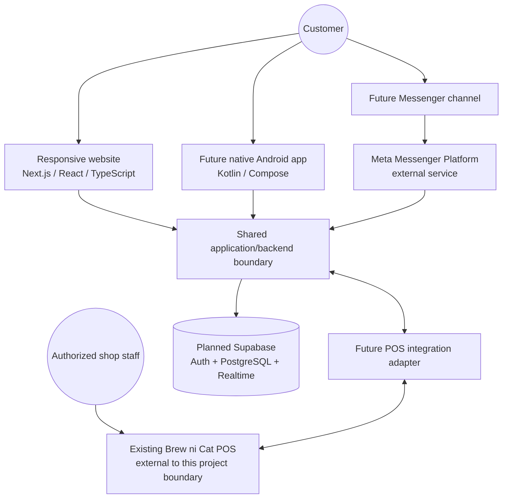
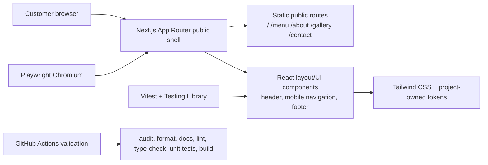
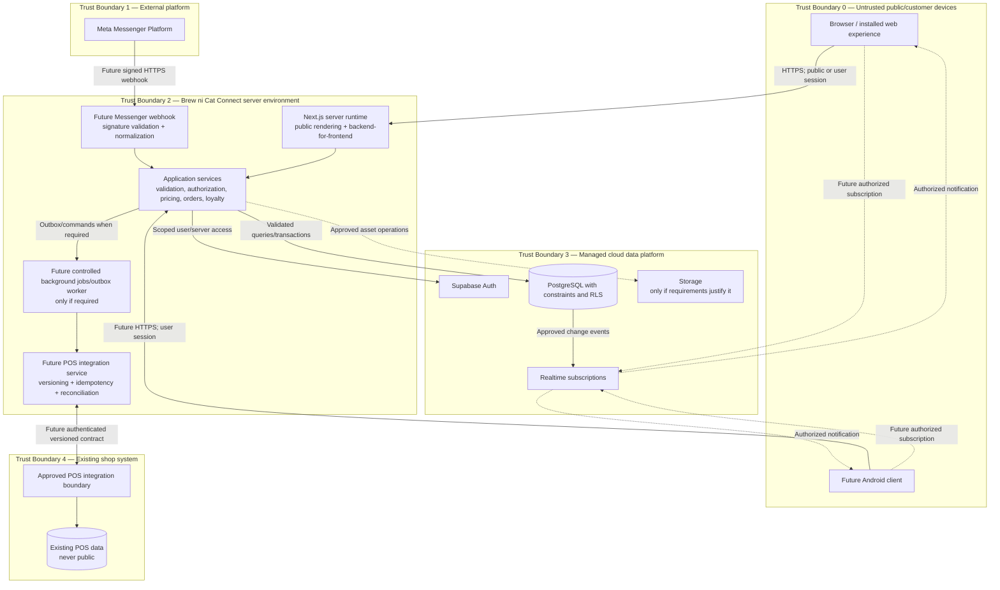
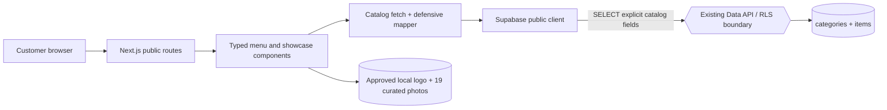

# Brew ni Cat Connect — System Architecture

**Version:** 0.1 Draft\
**Date:** 2026-08-24\
**Document status:** Living architecture baseline\
**Implementation status:** Phase 1 is Tested and merged. Phase 2 implements the public showcase and typed browser-runtime Supabase catalog reads; the current anonymous policy returns zero catalog rows. Customer data, writes, authentication, realtime, Messenger, Android, and POS integration remain Planned or Deferred.

## 1. Architecture objective

Brew ni Cat Connect is a customer-facing omnichannel platform that complements the existing Brew ni Cat POS. Its website, future Android application, future Messenger assistant, and controlled POS integration should use a shared backend and one set of validated business rules. It is not a replacement or reimplementation of the POS.

The design prioritizes:

- mobile-first public and ordering experiences;
- one canonical customer-facing catalog/order/loyalty model;
- server-side validation for every business effect;
- least-privilege access and explicit trust boundaries;
- incremental delivery, beginning with documentation and a web foundation;
- replaceable, versioned integration boundaries; and
- accurate behavior under retries, partial failure, and offline conditions.

## 2. Context view



**Current reality:** Phase 2 retains the Phase 1 Next.js foundation and replaces placeholders with real Home, Menu, About, Gallery, and Contact routes. It adds approved local media, factual business configuration, and a typed read-only Supabase catalog adapter. The app has no authentication, customer/order data, write operation, ordering service, realtime, Messenger, Android, or POS synchronization. Current anonymous catalog reads are policy-filtered to zero rows and surface a truthful empty state.

### 2.1 Phase 1 as-built boundary



The only client-side state in this increment controls the accessible mobile navigation. The routes render development placeholders and confirmed project identity only. There are no effectful business operations, cookies introduced by application code, customer records, API routes, server actions, or external-service calls.

## 3. Proposed container and trust-boundary view



Arrows show logical data flow, not a final deployment topology. Direct client-to-Supabase access may be used for specifically approved operations only when RLS and policy tests enforce the same authorization guarantees. Privileged operations, external integrations, pricing, order creation, and loyalty mutation remain server-controlled.

## 4. Component responsibilities and status

| Component | Responsibility | Status in Version 0.1 |
|---|---|---|
| Next.js App Router web application | Public business content, responsive customer UI, route boundaries, later authenticated ordering screens | **Implemented through the Phase 2 showcase** using Next.js 16.3.2; developer automation passed and independent review is pending |
| React component layer | Accessible, reusable presentation and interaction components | **Implemented through Phase 2:** shared shell, public sections, gallery, menu catalog/cards/states, and factual routes |
| TypeScript types/configuration | Compile-time types for UI, configuration, catalog mapping, and later integration boundaries | **Implemented for the public UI and menu catalog boundary**; ordering/customer contracts remain later work |
| Tailwind CSS presentation layer | Project-owned warm design tokens, responsive layout, focus styles, and reduced-motion baseline | **Implemented for Phase 1** using Tailwind CSS 4.3.3 |
| Automated verification boundary | Component behavior, route smoke checks, representative-width overflow checks, type/lint/build gates | **Implemented for Phase 1:** Vitest/Testing Library, Playwright, and GitHub Actions configuration |
| Backend-for-frontend/application service layer | Authenticate/authorize, validate requests, calculate authoritative outcomes, coordinate transactions, expose channel-neutral use cases | Proposed; interfaces evolve with requirements |
| Public Supabase catalog client | Read current approved categories/items through public configuration | **Implemented in Phase 2; existing anonymous policy currently returns zero rows** |
| Supabase Auth | Customer identity and session lifecycle | Selected for a later phase; sign-in methods and provider configuration remain undecided |
| PostgreSQL | Canonical customer-facing data, constraints, order snapshots/history, loyalty ledger | Planned for Phase 4; schema not yet approved |
| Row Level Security | Enforce least-privilege database access | Existing production policy is observed to filter anonymous catalog rows; Phase 2 changes no policy. Customer-scoped RLS design/testing remains later work |
| Realtime | Authorized order-status refresh notifications | Planned after canonical states exist |
| Messenger webhook | Verify Meta requests, normalize messages, invoke shared services, return policy-compliant responses | Deferred to Phase 7 |
| Conversational assistant | Grounded interpretation/discovery; never transaction authority | Candidate within Phase 7 subject to evaluation |
| Native Android client | Mobile UI consuming the same versioned backend contracts | Deferred to Phase 8 |
| POS integration adapter | Isolate legacy details, map versioned contracts, deduplicate, retry, and reconcile | Deferred to Phase 6 pending POS assessment |
| Background processing | Reliable asynchronous webhook/POS/event work where a requirement needs it | Not selected; add only with documented need |

## 5. Logical layers

The implementation should keep dependencies directed inward toward domain rules:

```text
Channel UI / Transport
        |
        v
Use cases / Application services
        |
        v
Domain rules and typed results
        |
        v
Ports (repositories, identity, messaging, POS)
        |
        v
Adapters (Supabase, Meta, POS, platform APIs)
```

- UI/routes translate user actions into use-case inputs and render typed outcomes.
- Application services coordinate authorization, validation, transactions, and idempotency.
- Domain modules contain testable calculations and state-transition rules without framework coupling.
- Ports describe capabilities; adapters contain provider-specific code.
- No channel owns a separate implementation of pricing, loyalty, or order-transition rules.

This is a proportional modular architecture, not a requirement to create independent microservices. A modular monolith is preferred initially to reduce operational complexity; deployment separation is introduced only for a measured scaling, isolation, or platform constraint.

## 6. Shared backend contract

All channels should ultimately invoke the same channel-neutral use cases:

| Domain capability | Web | Android | Messenger | POS adapter |
|---|---:|---:|---:|---:|
| Read published business/catalog data | Yes | Future | Future | Only as integration requires |
| Manage customer identity/profile | Later | Future | Account linking only if approved | No direct customer session |
| Build/validate cart | Later | Future | Future guided draft | No |
| Submit an order idempotently | Later | Future | Future confirmed flow | Receives mapped online order |
| Read authorized order state | Later | Future | Future after secure linking | Supplies/receives approved state updates |
| Loyalty/favorites | Later | Future | Only if justified | Only approved integration data |

“Same backend” means shared domain rules, identifiers, and canonical records—not necessarily that every client receives identical endpoints or permissions. Channel-specific adapters may reshape presentation while preserving the same authorization and business invariants.

## 7. Data ownership and sources of truth

Version 0.1 distinguishes business stewardship, system of record, and integration authority. Final legal/controller roles and retention policies require confirmation.

| Data domain | Current / planned system of record | Authority/stewardship | Notes |
|---|---|---|---|
| Public business identity, location, variable-hours notice, and contact/social facts | Phase 2 typed site configuration sourced from the confirmed client brief; future maintenance UI/CMS remains undecided | Brew ni Cat | Publish only confirmed values; promotions and future maintenance workflow remain owner decisions |
| Customer authentication credential material | Supabase Auth when activated in Phase 4 | Authentication provider processes credentials under configured terms; business role requires privacy review | Application must never store plaintext passwords |
| Customer profile | Shared PostgreSQL backend | Customer supplies data; Brew ni Cat intended business steward, subject to confirmation | Collect only fields required by approved features |
| Product/category/public variants and flavors | Existing Supabase `categories` and `items` catalog, read-only in Phase 2 | Brew ni Cat | Anonymous reads currently return zero rows; POS-hardcoded add-ons are not treated as live catalog data; avoid bidirectional edits |
| Published price and availability | Existing Supabase `items.variants_json` and `items.is_available`, read-only in Phase 2 | Brew ni Cat | Public access remains policy-blocked; a later checkout server must still revalidate authoritative current values |
| Online order request and immutable item/price snapshot | Shared backend initially proposed | Brew ni Cat | POS receives through a controlled interface; final ownership depends on integration design |
| Acceptance and fulfilment status | Authority undecided pending shop/POS workflow analysis | Authorized shop process | Customer-visible backend state must reconcile rather than guess |
| Order status history/audit metadata | Shared backend plus required POS audit | Brew ni Cat | Append/history-oriented; retention to be defined |
| Loyalty ledger and balance | Shared backend proposed | Brew ni Cat | Ledger transactions are authoritative; clients display derived results |
| Messenger event identifiers/content | Minimum server-side records required for processing and policy | Platform/customer/business roles require privacy review | Define minimization and deletion/retention before launch |
| Operational logs | Hosting/database/integration logging stores | Brew ni Cat/project operator as documented | Redact secrets and unnecessary personal data; restrict access |

No POS field-level authority is assumed until the existing POS schema, business process, and failure modes are analyzed and recorded in an architecture decision.

## 8. Primary data flows

### 8.1 Public content/menu read

1. Browser requests a public route over HTTPS.
2. Next.js renders/cache-controls approved published data according to freshness needs.
3. The data layer returns public fields only.
4. Customer receives semantic HTML and progressive client behavior.

Failure: serve a usable error/empty state; never replace unknown business facts with generated content. Availability-sensitive records must not use a cache policy that hides critical changes beyond the approved threshold.

### 8.2 Authenticated customer operation

1. Customer establishes a session with the configured authentication flow.
2. Client sends a request with session proof and an idempotency key for effectful retryable operations.
3. Server validates input, authenticates identity, authorizes resource ownership/role, and invokes a domain use case.
4. Database constraints/RLS provide defense-in-depth.
5. A typed, minimal result returns; logs contain correlation metadata but no credential/secret.

### 8.3 Order creation transaction

```mermaid
sequenceDiagram
    actor Client
    participant API as Application service
    participant Catalog as Catalog repository
    participant DB as PostgreSQL transaction
    participant Outbox as Integration outbox (future)

    Client->>API: Checkout command + idempotency key
    API->>API: Authenticate, authorize, validate shape
    API->>Catalog: Load current products/options/availability
    Catalog-->>API: Canonical current records
    API->>API: Calculate authoritative snapshots/totals
    API->>DB: Begin transaction; check idempotency
    DB->>DB: Insert order, item snapshots, initial history
    DB->>Outbox: Insert integration event when POS integration exists
    DB-->>API: Commit one order and reference
    API-->>Client: Pending order reference and current status
```

The outbox is a proposed reliability pattern, not an implemented component. Payment behavior remains unspecified pending owner approval.

### 8.4 Status update/realtime

An authorized shop/POS workflow proposes a valid transition. The server checks the expected prior state and actor permission, records new state and history transactionally, then emits/permits an authorized refresh notification. Clients treat notification payloads as hints and fetch canonical state. Stale or invalid transitions do not overwrite newer state.

### 8.5 Messenger

Meta sends a signed event to a server-only webhook. The webhook verifies signature/freshness and deduplicates before invoking shared services. Any assistant is grounded in approved data and has an allowlisted action surface. Order-specific data requires an approved secure linking flow. Platform tokens and webhook secrets never enter client code.

### 8.6 POS synchronization

The integration adapter exchanges only a versioned, minimal contract. It maps stable identifiers, validates messages, deduplicates, retries safely, quarantines unmappable/conflicting records, and supports reconciliation. Neither browser, Android, nor Messenger connects directly to the POS or its database.

## 9. Authentication and authorization architecture

### 9.1 Authentication

- Supabase Auth is planned for customer identity after Phase 4 design.
- Exact sign-in methods, verification requirements, and account recovery policy are `TODO: Confirm with Brew ni Cat owner.`
- Secure, HTTP-only cookies are preferred where an applicable server-rendered web session design supports them; final session architecture must be documented before implementation.
- Android tokens use platform-protected storage when the app is introduced.
- Messenger platform identity is not automatically equivalent to a Brew ni Cat customer account.
- POS and other integrations use distinct non-human service identities, never customer credentials.

### 9.2 Authorization

- Deny by default.
- Customer may access only their own protected profile, orders, favorites, and loyalty records.
- Shop/staff permissions require a separately defined role model and administration boundary; no admin UI is assumed in Version 0.1.
- RLS protects direct database access paths; application checks protect use-case semantics and privileged operations.
- Service-role keys bypassing RLS stay server-only and are used narrowly.
- Authorization tests cover cross-account reads/writes and role escalation attempts.

## 10. Security and privacy boundaries

| Boundary crossing | Threats | Required controls |
|---|---|---|
| Customer device → web/application service | Tampering, injection, replay, credential abuse, automation | HTTPS, schema validation, server calculations, secure session, CSRF protection where applicable, rate limits, idempotency |
| Customer client → realtime service | Cross-account subscription, metadata leakage, stale events | Authenticated scoped topics/RLS, minimal payload, re-fetch canonical record |
| Meta → Messenger webhook | Forged request, replay, event flood, malicious text | Signature/freshness verification, idempotency, rate limit, schema validation, allowlisted actions |
| Application → Supabase | Excess privilege, secret exposure, SQL/data leak | Environment secrets, separated roles/projects, parameterized access, RLS, audited migrations, log redaction |
| Shared backend → POS adapter | Spoofed service, schema mismatch, duplicates, conflict | Mutual/strong service authentication as supported, versioned schema, stable IDs, idempotency, reconciliation, least privilege |
| Build/deployment → production | Supply-chain compromise, secret leak, unreviewed migration | Lockfile, dependency/license review, protected secrets, CI checks, reviewed migrations, controlled deployment/rollback |

Privacy architecture follows data minimization and purpose limitation. Retention, deletion, data-subject request handling, analytics, incident response, and vendor-processing details will be completed in the security/privacy and deployment phases with consideration for RA 10173. No production personal data belongs in development fixtures, screenshots, commits, or test output.

## 11. Reliability and failure architecture

- **Idempotency:** order creation, loyalty awards/redemptions, inbound webhook events, and POS messages need stable deduplication keys.
- **Transactions:** order + items + initial history and loyalty ledger mutations must preserve atomic invariants.
- **Retries:** use exponential backoff with bounded attempts and jitter; do not retry permanent validation/authorization errors.
- **Outbox/inbox:** use when reliable cross-system event delivery is introduced; do not make a database commit and remote call appear atomic.
- **Reconciliation:** compare shared-backend and POS states by stable identifiers; surface unresolved conflicts for authorized review.
- **Degraded mode:** public pages should remain usable when optional services fail; checkout clearly reports unconfirmed outcomes; realtime falls back to refetch/polling; conversational help falls back to deterministic navigation.
- **Observability:** structured logs, correlation IDs, metrics, and actionable alerts without secrets or unnecessary personal data.
- **Backup/recovery:** define Supabase/database backup availability, restore responsibility, recovery objectives, and restore testing before production.

Exact availability, recovery, performance, and retention targets belong in non-functional requirements and must be tested against realistic capacity.

## 12. Deployment and environment topology

The hosting provider for the Next.js runtime is not selected in Version 0.1. The logical environments are:

| Environment | Purpose | Data rule |
|---|---|---|
| Local development | Developer feedback and unit/component testing | Synthetic fixtures or data labeled `MOCK DATA — FOR DEVELOPMENT ONLY` |
| Test/preview | Integration, review, and automated checks | Isolated synthetic data; no production secrets |
| Production | Customer/business operation after approval | Confirmed business data and minimized customer data |

Each environment should have separate credentials and, where practical, separate backend projects/resources. `.env.example` documents variable names only. Secrets live in approved local/deployment secret stores, are scoped/rotated, and never committed.

Database schema changes use reviewed, version-controlled migrations with a forward/rollback or corrective plan appropriate to the change. Application releases must remain compatible across staged schema/client rollout.

## 13. Repository boundaries

The Phase 2 as-built structure extends the Phase 1 foundation only where the showcase and catalog boundary require it:

```text
src/
  app/                 # App Router layout, public routes, loading/error/not-found states
  components/
    layout/            # site header, mobile navigation, footer
    ui/                # narrow reusable presentation components
  config/              # typed site navigation/project configuration
tests/
  unit/                # Vitest + Testing Library component/page behavior
  e2e/                 # Playwright route, mobile-menu, 404, and width smoke tests
.github/workflows/      # lightweight pull-request/push validation
docs/                   # version-controlled specification and evidence
```

`src/lib/menu`, `src/lib/supabase`, `src/types`, and menu/public UI components now exist for the justified Phase 2 read boundary. Server ordering, customer-domain, mutation, authentication, and broad integration directories remain absent until an approved capability needs them.

Rules:

- Mark server-only modules and prevent import into client bundles.
- Keep provider SDK calls behind adapters rather than throughout UI components.
- Keep validation schemas close to their boundary and domain invariants in domain modules.
- Prefer feature cohesion over deeply generic abstractions.
- Do not add `android/`, Messenger, POS adapter, or database structure before its phase and architecture decision justify it.

## 14. Key architecture decisions and open questions

### Direction established in Version 0.1

1. Use Next.js App Router, React, and TypeScript for the web foundation.
2. Prefer an initial modular monolith over microservices.
3. Plan Supabase for PostgreSQL/auth/realtime, gated by schema, RLS, and privacy design.
4. Keep business rules in shared server/domain modules; clients are not transaction authorities.
5. Build native Android later with Kotlin/Compose against versioned shared contracts.
6. Integrate Messenger later only through a secured server-side webhook.
7. Isolate the existing POS behind an assessed, authenticated adapter; never expose its tables directly.

These decisions are recorded in [`decisions.md`](decisions.md) with context, alternatives, consequences, and status; later architecture changes must keep the records synchronized.

### Open questions

- Hosting/runtime and regional deployment choice for the Next.js application.
- Approved customer authentication methods and required profile data.
- Catalog, price, availability, order acceptance, and fulfilment sources of truth after POS assessment.
- Staff/admin access boundary and role model.
- Payment/pickup/cancellation/loyalty business policies.
- Delivery scope: `TODO: Confirm with Brew ni Cat owner.`
- Final realtime performance/freshness target and polling fallback limits after validating the preliminary NFR-004 target.
- Final backup/restore objectives and incident contacts after validating the preliminary NFR-009 targets.
- Messenger account linking, data retention, human handoff, and whether AI passes a documented value/risk evaluation.
- Android minimum API level, notification scope, and distribution process.

## 15. Architecture validation gates

Before each later phase begins:

1. Link scope to functional and non-functional requirement IDs.
2. Update the context/data-flow diagrams to match the intended increment.
3. Record consequential decisions and threat/privacy considerations.
4. Define typed/versioned interfaces and their ownership.
5. Add success, failure, authorization, retry, and rollback test cases.
6. Run lint, type checking, tests, and production build; record literal results.
7. Review database migrations/RLS/integration contracts where applicable.
8. Update development log and evidence without marking unexecuted work as tested.

The Phase 1 foundation is **Tested and merged**. Phase 2 showcase/catalog code passed developer automation and is in **Testing / Review**, with live public rows **In development** because existing anonymous access returns zero rows. Every mutation, customer-data, backend, or additional-channel entry remains **Planned** or **Deferred** until implementation and evidence exist.

## 16. Requirements traceability

| Architecture concern | Functional requirements | Principal non-functional requirements |
|---|---|---|
| Public web and catalog presentation | FR-001–FR-016 | NFR-001, NFR-005, NFR-029–NFR-035 |
| Shared cart, ordering, and tracking services | FR-017–FR-030, FR-044–FR-049 | NFR-002–NFR-010, NFR-015, NFR-038 |
| Supabase authentication, customer data, and RLS | FR-031–FR-043 | NFR-013–NFR-019, NFR-023–NFR-027 |
| Loyalty domain and transaction boundary | FR-050–FR-057 | NFR-006, NFR-014–NFR-015, NFR-021, NFR-025, NFR-038 |
| Messenger webhook/assistant adapter | FR-058–FR-064 | NFR-018, NFR-022–NFR-028 |
| Android channel adapter | FR-065–FR-070 | NFR-019, NFR-025, NFR-028, NFR-036 |
| POS adapter, mapping, and reconciliation | FR-071–FR-081 | NFR-006, NFR-008, NFR-021–NFR-022, NFR-038 |
| Cross-cutting transport, operations, and delivery | Applicable FRs above | NFR-011–NFR-012, NFR-017, NFR-020, NFR-037–NFR-040 |

## 17. Phase 2 As-built Catalog and Media Boundary



### 17.1 Runtime and build behavior

The Menu component begins retrieval after browser render. `getPublicSupabaseClient()` validates only the public URL and publishable-key variables, disables authentication persistence/refresh, and issues explicit `SELECT` projections for `categories` and `items`. `fetchPublicMenu()` centralizes the two reads; `mapMenuCatalog()` converts nullable/untrusted row shapes into immutable application types and rejects malformed names/prices/options.

Compilation, CI, and static route generation do not contact Supabase. Missing public variables throw a customer-safe configuration error consumed by the menu error state. API errors produce retry; a successful zero-row response produces the empty state. Neither path leaks raw error details.

### 17.2 Data ownership and source of truth

- Supabase is authoritative for current category, item, price, variant/flavor, optional combo-description, and availability fields.
- The old poster images are non-authoritative visual references and never feed structured price data.
- The existing POS was inspected as a schema reference only; Brew ni Cat Connect does not expose or modify POS tables.
- The application uses alphabetical category/item order because no database display-order field was discovered.
- POS-hardcoded add-ons are not represented as live public facts.

### 17.3 Access blocker and required change boundary

Both public credential probes returned HTTP 200 and zero rows; a controlled privileged read-only comparison found six categories and sixteen items. This is consistent with row filtering by the existing anonymous policy. Phase 2 made no database/RLS change and no production mutation.

The required follow-up is a separately reviewed, owner-approved public view or minimum-field `SELECT` policy. Verification must run as the anonymous/public role and prove that approved catalog fields are readable while internal/customer/business records and all writes remain denied. The browser must never receive privileged credentials.

### 17.4 Media and privacy boundary

The official logo and 19 selected approved shop/customer images ship from `public/images`. Next.js Image supplies responsive sizing and optimization. Alternative text is generic and factual; it does not name customers or infer personal/sensitive attributes. The application does not add customer-recognition, analytics, upload, or external media-processing services.
